# DealFlow360 Master Implementation Plan & Architecture

This document defines the end-to-end technical blueprint for DealFlow360.
The work is split into two completely independent workstreams for **Akthar** and **Ashrith**.

---

## 1. System Architecture

```mermaid
graph TD
    subgraph Core [hackathon_core - FROZEN]
        DQ[dealflow.quote]
        DQL[dealflow.quote.line]
        DP[dealflow.product]
    end

    subgraph FeatureA [hackathon_feature_a - AKTHAR]
        DTA[dealflow.discount.tier]
        DAL[dealflow.approval.log]
        DHA[dealflow.deal.health]
        BRS[Blended Risk Score Engine]
        APPR[Multi-tier Approvals: Manager & Finance]
        PORTAL[Customer Negotiation Portal / Web Controller]
        DASH[Deal Health & Anomaly Dashboard]
    end

    subgraph FeatureB [hackathon_feature_b - ASHRITH]
        DWH[dealflow.warehouse & stock]
        DFS[dealflow.fulfillment.split]
        DSP[dealflow.subscription.plan]
        DBS[dealflow.billing.schedule]
        DUR[dealflow.upsell.rule]
        SPLIT[Stock-aware Warehouse Split Engine]
        BILL[Hybrid Billing & Proration Engine]
        UPSELL[Live Upsell & Cross-sell Intelligence]
    end

    DQ --> BRS
    DQ --> APPR
    DQ --> PORTAL
    DQ --> DASH
    DQ --> SPLIT
    DQ --> BILL
    DQ --> UPSELL
```

---

## 2. Phase 0: Core Foundation (`hackathon_core` - COMPLETED & FROZEN)
- [x] Base quotation model `dealflow.quote` with status workflow, customer details, and computed totals.
- [x] Base line model `dealflow.quote.line` with product links, quantities, margins, and subtotal math.
- [x] Product catalog `dealflow.product` categorized into Hardware, Service, and Subscription.
- [x] Base Tree, Form, and Kanban pipeline views with extensible `<notebook>` container.
- [x] Security access permissions in `ir.model.access.csv`.

---

## 3. Akthar's Workstream (`hackathon_feature_a`)

### Milestone A1: Discount Ceilings & Configuration
- **Model**: `dealflow.discount.tier`
  - Fields: `customer_tier` (Bronze, Silver, Gold), `category_type` (Hardware, Service, Subscription), `max_discount_allowed`, `manager_approval_threshold`, `finance_approval_threshold`.
  - Default rules:
    - Bronze: up to 5% standard (Hardware: 5%, Service: 3%)
    - Silver: up to 10% standard (Hardware: 10%, Service: 7%)
    - Gold: up to 15% standard (Hardware: 15%, Service: 10%)
- **UI**: Configuration menu under `DealFlow360 > Configuration > Discount Tiers`.

### Milestone A2: Blended Discount Risk Score Engine
- **Logic**:
  - Check each line: if line discount > line category ceiling for customer tier, flag violation points.
  - Calculate cumulative order margin erosion: total dollar discount given across all lines divided by gross margin baseline.
  - Formula:
    $$\text{Blended Risk Score} = \max(\text{Line Violations}) \times 0.6 + (\text{Cumulative Margin Loss \%}) \times 0.4$$
  - Assign `risk_level`:
    - `<= 0`: Low (No approval required)
    - `0 < score <= 10`: Medium (Requires Sales Manager approval)
    - `> 10`: High (Requires Sales Manager followed by Finance approval)

### Milestone A3: Multi-Tier Approval Chain & Audit Trail
- **Model**: `dealflow.approval.log`
  - Fields: `quote_id`, `user_id`, `action` (Requested, Manager Approved, Finance Approved, Rejected), `timestamp`, `reason`, `risk_score_at_action`.
- **Workflow on `dealflow.quote`**:
  - `action_submit_approval()`: Automatically routes quote to `pending_manager` or `pending_finance` based on risk score.
  - `action_approve_manager()`: Advances to `pending_finance` if required, or directly to `approved`.
  - `action_approve_finance()`: Confirms finance sign-off, advances to `approved`.
  - `action_reject(reason)`: Prompts for rejection reason, logs entry, sets state to `rejected` or returns to `draft`.
- **UI**: Risk badge on form header, Approval/Rejection buttons, and Audit Log tab.

### Milestone A4: Customer Negotiation Portal
- **Web Controller**: `controllers/portal.py`
  - Route: `/dealflow/portal/<token>` (Dedicated, restricted customer-facing web view).
  - Features:
    - View quotation line items and totals.
    - Propose line-level counter discount or whole-quote counter.
    - Add negotiation comments / remarks.
    - Submit counter or Accept terms with 1-click.
- **Auto Re-Routing**:
  - If counter terms exceed discount thresholds, quotation automatically transitions back to `pending_manager` / `pending_finance`.

### Milestone A5: Deal Health & Anomaly Dashboard
- **Model**: `dealflow.deal.health`
  - Track stalled quotations (inactive for $>X$ days, default 3 days).
  - Detect discount anomalies (quote discount exceeds rep's historical average by $>5\%$).
  - Delivery promise slippage alerts.
  - Automated "Nudge Rep" / "Escalate" action button.

---

## 4. Ashrith's Workstream (`hackathon_feature_b`)

### Milestone B1: Multi-Warehouse & Stock Architecture
- **Models**:
  - `dealflow.warehouse`: Code, Name, Location, Shipping Cost Weight factor.
  - `dealflow.warehouse.stock`: Warehouse ID, Product ID, Available Quantity, Replenishment Threshold.
- **Data**: Seed data for "Main Warehouse" (high inventory, low shipping weight) and "East Depot" (regional stock).

### Milestone B2: Multi-Warehouse Fulfillment Splitting Engine
- **Model**: `dealflow.fulfillment.split`
  - Fields: `quote_id`, `line_id`, `product_id`, `warehouse_id`, `quantity_allocated`, `shipping_cost`.
- **Splitting Algorithm**:
  - Evaluates stock availability across warehouses.
  - Prioritizes warehouses that can fulfill full order lines to minimize total shipment count.
  - Applies warehouse shipping weight factors to calculate estimated shipping cost.
  - Manual override capability: Ops user can reassign quantities between warehouses.
- **Backorder Consolidation**:
  - If item is partially in stock, marks remaining quantity as backorder.
  - When replenishment arrives, triggers "Consolidate Remaining Backorder" prompt to bundle into single shipment.

### Milestone B3: Hybrid Billing & Subscription Proration
- **Models**:
  - `dealflow.subscription.plan`: Plan name, Billing Period (Monthly, Quarterly, Annual), Proration Policy.
  - `dealflow.billing.schedule`: Quote ID, Billing Date, Amount, Line Description, State (Scheduled, Invoiced, Paid).
- **Billing Logic**:
  - Separates one-time Hardware/Service charges (invoiced immediately upon confirmation) from recurring Subscription lines.
  - Generates automated recurring billing schedule entries.
  - Mid-cycle proration engine: adjusts billing when subscription seats/quantities change mid-month.

### Milestone B4: Live Upsell & Cross-Sell Recommendation Engine
- **Model**: `dealflow.upsell.rule`
  - Pairing rules: When Product A is in cart, suggest Product B (e.g., Server $\rightarrow$ Extended Warranty or Cloud Backup).
  - Promoted products tag.
  - Minimum margin threshold filtering (only surfaces high-margin recommendations).
- **Interactive UI**:
  - Real-time recommendation panel on quote builder.
  - Displays product card, promotion tag, and live margin delta ($+\$X$ margin).
  - One-click "Add to Quote" appends item directly to `line_ids` and refreshes order margins instantly.

---

## 5. End-to-End Verification Checklist (Problem Statement Walkthrough)
1. [ ] **Backend Setup**: Create discount tiers, warehouses, stock levels, subscription plans.
2. [ ] **High Discount Trigger**: Create quote with 20% discount $\rightarrow$ verifies auto-routing to Manager + Finance.
3. [ ] **Live Upsell Acceptance**: Add suggested warranty from upsell panel $\rightarrow$ verify order total & margin update immediately.
4. [ ] **Manager & Finance Approval**: Approve via audit trail $\rightarrow$ state updates to `approved`.
5. [ ] **Warehouse Split Fulfillment**: Run split algorithm $\rightarrow$ verifies stock pulled across Main Warehouse & East Depot.
6. [ ] **Hybrid Billing Schedule**: Verify hardware is invoiced immediately while subscription lines populate monthly schedule.
7. [ ] **Customer Portal Counter**: Open customer portal link, counter with $+5\%$ discount $\rightarrow$ verifies quote re-enters approval chain.
8. [ ] **Confirmation & Deal Health**: Confirm order, record payment, check Deal Health dashboard for deal status.
