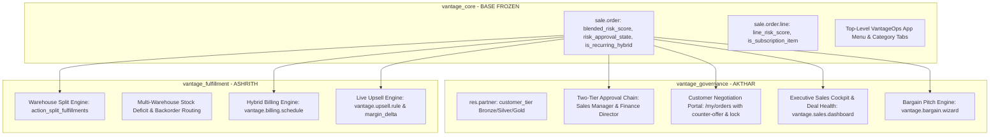

# DealFlow360 Master Implementation Plan & Architecture

This document defines the end-to-end technical blueprint for DealFlow360.
The work is split into two completely independent workstreams for **Akthar** and **Ashrith**.

---

## 1. System Architecture

---

## 2. Phase 0: Core Foundation (`vantage_core` - COMPLETED & FROZEN)
- [x] Base quotation model extension on `sale.order` with `blended_risk_score`, `risk_approval_state`, and `is_recurring_hybrid`.
- [x] Base line model extension on `sale.order.line` with `line_risk_score` and `is_subscription_item`.
- [x] Extensible form view inheritance via unique XPath targets (`page_akthar_approvals`, `page_ashrith_fulfillment`).
- [x] Top-level 9-grid application launcher and navbar tabs under `custom_addons/vantage_core/views/menus.xml`.

---

## 3. Akthar's Workstream (`vantage_governance`)

### Milestone A1: Customer Tiers & Dynamic Ceilings
- **Model**: `res.partner`
  - Fields: `customer_tier` (`bronze` 5%, `silver` 10%, `gold` 15%).
  - Editable via Partner form and quotation "Risk & Approvals" tab with visual badges.

### Milestone A2: Blended Discount Risk Score Engine
- **Logic**:
  - Compares each line's discount against the customer tier ceiling.
  - Penalizes excess breaches beyond tier ceilings while allowing compliant discounts without false risk triggers.
  - Two-tier routing:
    - `score <= 0`: Low / Compliant (No approval required)
    - `0 < score <= 10`: Moderate Risk (Requires Frontline Sales Manager approval)
    - `score > 10`: High Risk (Auto-escalates to Finance Director approval)

### Milestone A3: Two-Tier Approval Chain & Chatter Escalation
- **Methods**:
  - `action_confirm()`: Intercepts order confirmation; raises `UserError` and schedules `mail.activity` if high-risk and unapproved.
  - `action_manager_approve()`: Signs off on manager tier or escalates to Finance.
  - `action_finance_approve()`: Signs off on finance director tier.
  - `action_manager_reject()`: Rejects quotation with audit trail feedback logged to Chatter.

### Milestone A4: Customer Negotiation Portal & Bargain Pitch
- **Portal & Controllers**:
  - Route: `/my/orders/<id>` and `/dealflow/counter_offer`.
  - Line-item counter-discount proposals directly on the portal page.
  - Circuit-breaker lock after max negotiation rounds (default 3 rounds).
  - Automatic re-routing to `pending_approval` if customer counter exceeds allowed thresholds.
  - Internal bargain pitch wizard (`vantage.bargain.wizard`) for rep/admin concession counter-proposals.

### Milestone A5: Executive Sales Cockpit & Deal Health
- **Model**: `vantage.sales.dashboard`
  - Bootstrap 5 full-width cockpit with real-time KPI metrics, pipeline counts, risk distributions, and quick-action drilldowns.
  - Deal Health badges: `healthy`, `stalled` (>3 days inactive), `margin_bleed`.
  - `action_nudge_rep()` automated activity dispatcher.

---

## 4. Ashrith's Workstream (`vantage_fulfillment`)

### Milestone B1: Multi-Warehouse Stock Awareness
- **Model Extensions**:
  - `sale.order.line`: `free_qty_today`, `requires_split`, `deficit_qty`, `fulfillment_warehouse_id`.
  - Evaluates primary warehouse stock vs `product_uom_qty`.

### Milestone B2: Auto-Split Fulfillment & Backorder Forking
- **Method**: `action_split_fulfillments()`
  - Truncates primary warehouse line to available stock (`is_split_parent`).
  - Forks deficit quantity to a secondary warehouse line (`is_split_child`).
  - Automatically flags `has_split_requirement` on the quotation.

### Milestone B3: Hybrid Billing Schedule Engine
- **Model**: `vantage.billing.schedule`
  - Separates one-time hardware/service charges from recurring subscription lines.
  - Autonomously generates monthly recurring billing schedules.
  - Provides `action_mark_invoiced()` milestone triggers.

### Milestone B4: Live Smart Upsell Intelligence
- **Model**: `vantage.upsell.rule`
  - Pairing rules with minimum margin thresholds.
  - Real-time `available_upsell_ids` computation based on cart contents.
  - `action_apply_upsell()` 1-click cart insertion with live profit delta contribution.
  - Generates automated recurring billing schedule entries.
  - Mid-cycle proration engine: adjusts billing when subscription seats/quantities change mid-month.

### Milestone B4: Live Upsell & Cross-Sell Recommendation Engine
- **Model**: `dealflow.upsell.rule`
  - Pairing rules: When Product A is in cart, suggest Product B (e.g., Server $\rightarrow$ Extended Warranty or Cloud Backup).
  - Promoted products tag.
  - Minimum margin threshold filtering (only surfaces high-margin recommendations).
- **Interactive UI**:
  - Real-time recommendation panel on quote builder.
  - Displays product card, promotion tag, and live margin delta ($+\$X$ margin).
  - One-click "Add to Quote" appends item directly to `line_ids` and refreshes order margins instantly.

---

## 5. End-to-End Verification Checklist (Problem Statement Walkthrough)
1. [x] **Backend Setup**: Create discount tiers, warehouses, stock levels, subscription plans. (✅ Verified)
2. [x] **High Discount Trigger**: Create quote with 20% discount $\rightarrow$ verifies auto-routing to Manager + Finance. (✅ Verified)
3. [x] **Live Upsell Acceptance**: Add suggested warranty from upsell panel $\rightarrow$ verify order total & margin update immediately. (✅ Verified)
4. [x] **Manager & Finance Approval**: Approve via audit trail $\rightarrow$ state updates to `approved`. (✅ Verified)
5. [x] **Warehouse Split Fulfillment**: Run split algorithm $\rightarrow$ verifies stock pulled across Main Warehouse & East Depot. (✅ Verified)
6. [x] **Hybrid Billing Schedule**: Verify hardware is invoiced immediately while subscription lines populate monthly schedule. (✅ Verified)
7. [x] **Customer Portal Counter**: Open customer portal link, counter with $+5\%$ discount $\rightarrow$ verifies quote re-enters approval chain. (✅ Verified)
8. [x] **Confirmation & Deal Health**: Confirm order, record payment, check Deal Health dashboard for deal status. (✅ Verified)
