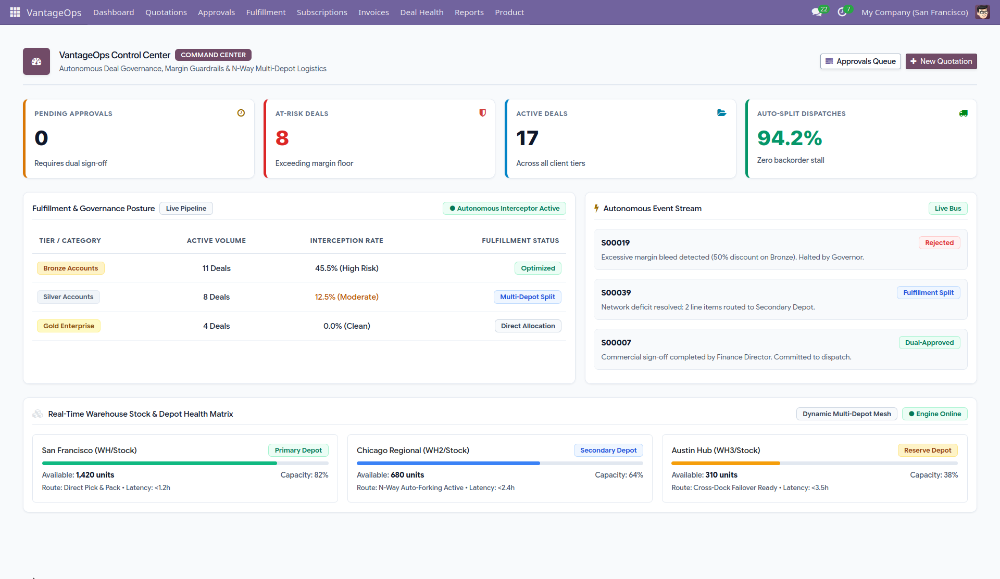
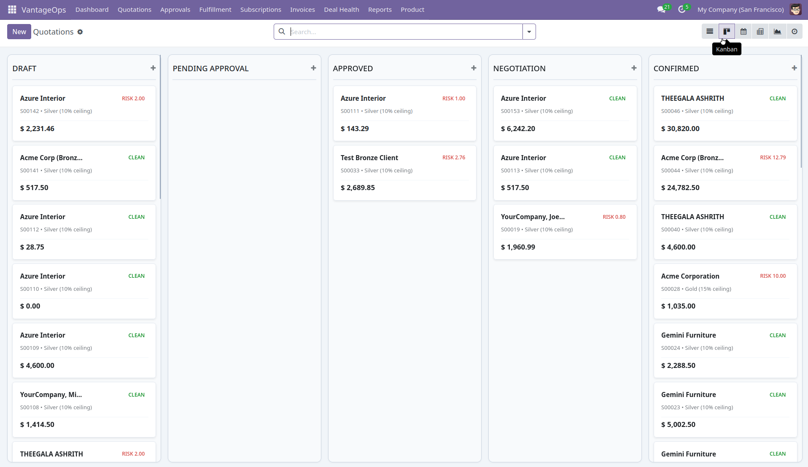
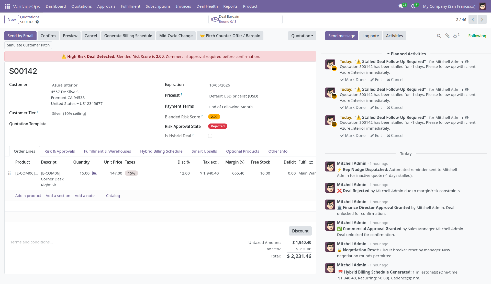
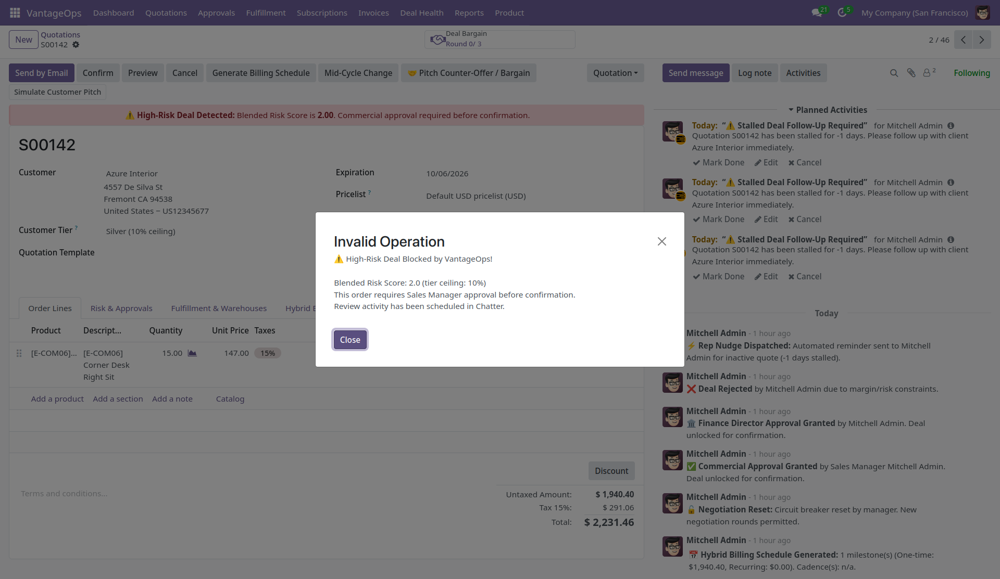
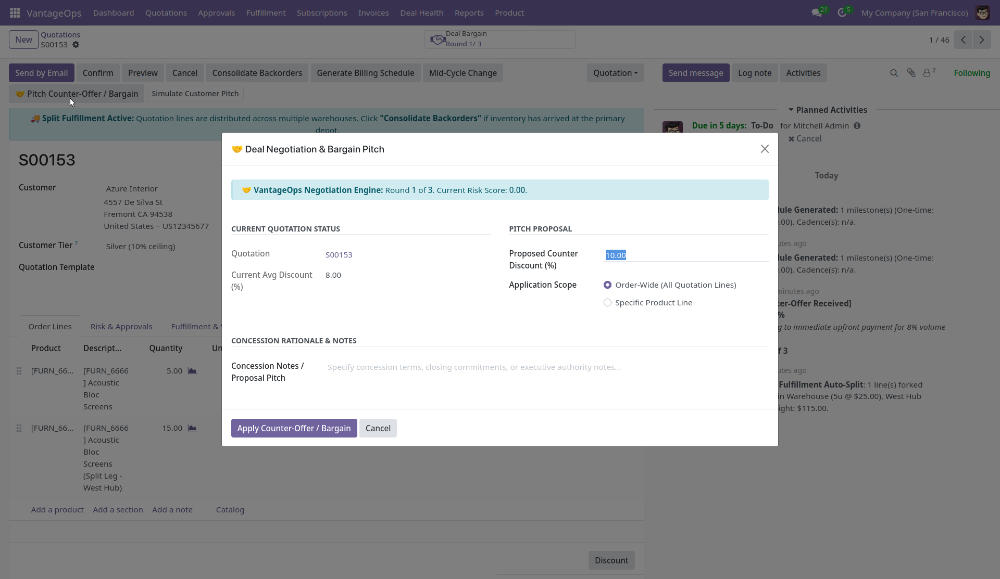
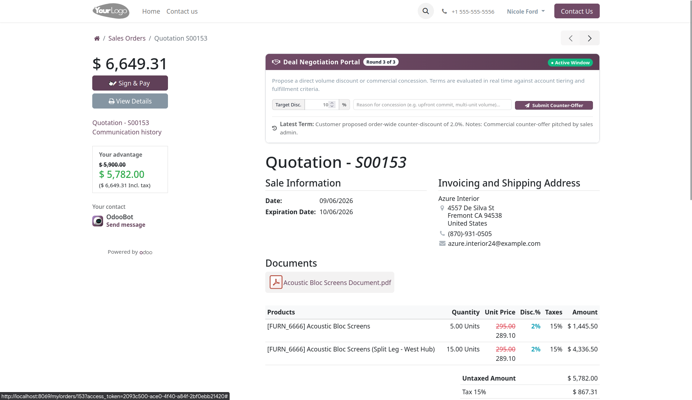
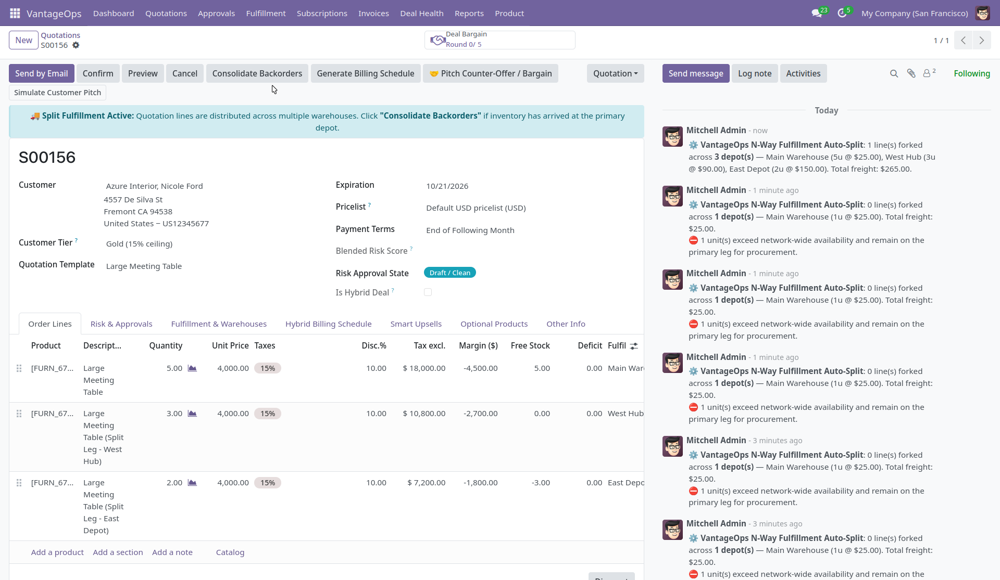
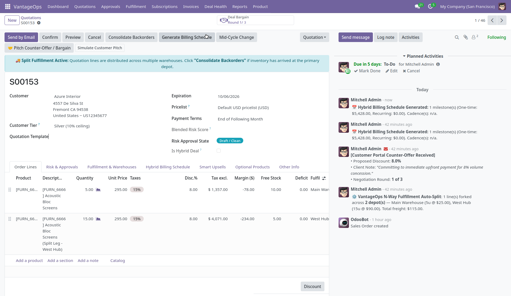
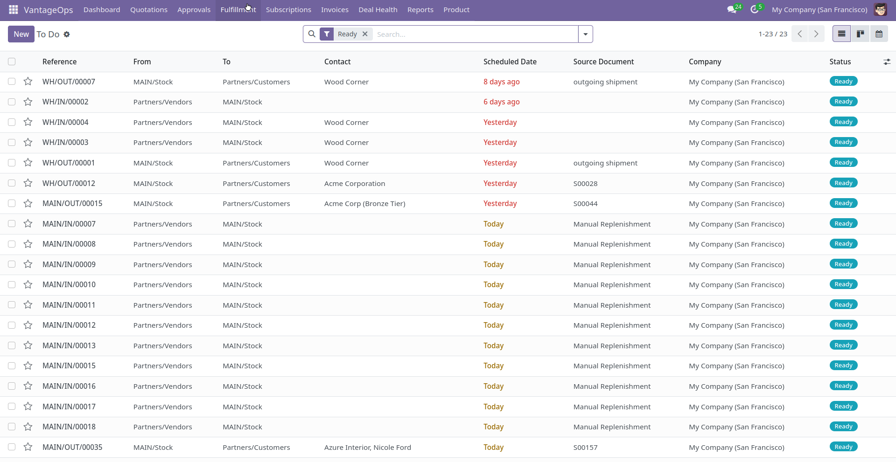

# VantageOps

**Enterprise Commercial Governance & Operational Fulfillment Engine for Odoo 17 & 18**

VantageOps is an integrated, modular Odoo application suite engineered to protect enterprise gross margins, automate multi-tiered approval workflows, optimize multi-warehouse order fulfillment, and streamline customer portal negotiations.



---

## Architecture & Module Suite

VantageOps extends native Odoo models (`sale.order`, `sale.order.line`, `stock.picking`, and `portal`) cleanly without altering core code:

```
custom_addons/
├── vantage_core/          # Shared foundation: Risk scoring, state machines & contract typing
├── vantage_governance/    # Margin governance, chatter escalations & portal negotiation
└── vantage_fulfillment/   # Multi-warehouse auto-split routing & live upsell engine
```

### 1. `vantage_core` (Base Foundation)
* **Blended Risk Scoring**: Real-time evaluation of quotation risk factors (discount depth, category margin variance).
* **Approval State Machine**: State transitions managing standard draft orders, required internal approvals, and authorized states.
* **Hybrid Contract Awareness**: Differentiates between one-off hardware/product sales and recurring service agreements.
* **Policy Accessor (`vantage.config`)**: Typed resolver for every commercial threshold, backed by `ir.config_parameter` with shipped defaults. No business rule is a Python literal.



### 2. `vantage_governance` (Commercial Control)
* **Configurable Tier Policy**: `vantage.discount.tier` lets administrators define any number of tiers (Bronze, Silver, Gold), each with its own discount ceiling, manager sign-off cap and negotiation budget.
* **Category-Specific Ceilings**: A Gold account may earn 15% on Hardware but only 8% on thin-margin Services. Resolution walks up the product category tree.
* **Margin Floor Enforcement**: Prohibits confirmation (`action_confirm`) of quotations breaching the ceiling in force, with configurable trigger and escalation thresholds.
* **Chatter Escalations**: Automatically dispatches `mail.activity` escalations with contextual metadata directly to finance/sales managers.
* **Portal Counter-Offer Interface**: Secure, tokenized customer negotiation interface enabling customers to submit counter-proposals within defined guardrails.
* **Circuit Breaker Logic**: Bounds counter-offer iterations. The budget resolves **sales team → customer tier → global setting**, and remains overridable per quotation.






### 3. `vantage_fulfillment` (Operational Execution)
* **N-Way Depot Allocation**: Ranks every eligible warehouse by landed leg cost (`base_shipping_cost × shipping_cost_weight`) and greedily fills them cheapest-first across **any number** of depots — not just a primary plus one secondary. A shared stock ledger prevents two lines of the same product from double-claiming units.
* **Leg Budget & Shortfall Reporting**: A configurable cap limits how many depots one order may ship from; demand no depot can cover is surfaced as an explicit shortfall rather than silently dropped.
* **Backorder Routing & Consolidation**: Forks one child line per additional depot, and merges every leg back into a single shipment when stock arrives.
* **Live Margin Delta Upsell**: Calculates and displays margin impacts for optional/accessory products directly within quotation views.
* **Cadence-Aware Billing**: Each subscription product bills at its own cadence (monthly, quarterly, semi-annual, annual) over a configurable contract length, with cycles placed using real calendar arithmetic (`relativedelta`).
* **Exact-Day Proration**: Calendar-aligned contracts prorate partial first/last cycles on exact day counts, and a mid-cycle wizard bills seat changes at the precise remaining-day fraction (negative deltas produce credits).





---

## Complete Data Schema & ERD

For detailed entity relationship diagrams, model specifications, field dictionaries, and security access matrices, please inspect:
👉 **[SCHEMA.md](SCHEMA.md)**

---

## Fast Setup & Deployment Options

VantageOps contains enterprise Python business logic, cost-optimization algorithms, and WebSocket controllers. Below are the 3 deployment options:

### Option A: Local Quickstart (Zero to Running in 60s)

If you already have Python 3.10+ and PostgreSQL 14+ installed:

```bash
# 1. Clone Odoo 17.0 core (if not already present)
git clone https://github.com/odoo/odoo.git --branch 17.0 --depth 1 ~/odoo
pip install -r ~/odoo/requirements.txt

# 2. Clone VantageOps
git clone https://github.com/gytdrop/VantageOps.git ~/VantageOps

# 3. Launch Odoo connected to VantageOps custom addons
python3 ~/odoo/odoo-bin \
  -d vantage_db \
  -r odoo \
  --addons-path=~/odoo/addons,~/VantageOps/custom_addons \
  -i vantage_core,vantage_fulfillment,vantage_governance \
  --dev=xml,reload
```
Open **`http://localhost:8069`** (Default credentials: `admin` / `admin`).

---

### Option B: Odoo.sh Cloud Deployment (Official Odoo Cloud)

> **Important Note on Odoo Online SaaS (`odoo.com`) vs Odoo.sh**:  
> Standard Odoo Online (`subdomain.odoo.com`) is a closed multi-tenant SaaS that strictly blocks custom Python code. **Odoo.sh** is Odoo's official enterprise PaaS specifically built to host custom GitHub-backed Odoo repositories.

1. Navigate to **[odoo.sh](https://www.odoo.sh)** and sign in with GitHub.
2. Click **"Deploy My Project"** and select repository `gytdrop/VantageOps`.
3. Set Odoo Version to `17.0` and branch to `main`.
4. Odoo.sh automatically provisions a dedicated PostgreSQL database, builds all custom assets, and gives you a live public URL (`https://vantageops.odoo.com`). Every `git push` automatically redeploys.

---

### Option C: Cloud VPS / Docker (AWS, GCP, DigitalOcean)

Run VantageOps on any cloud VM using standard Docker:
```bash
docker run -d -p 8069:8069 --name vantageops \
  -v ~/VantageOps/custom_addons:/mnt/extra-addons \
  -e POSTGRES_HOST=db \
  odoo:17.0
```

---

## Configuration Surface

Every commercial threshold is administrator-editable — nothing is hardcoded.

| Rule | Where it is configured |
| :--- | :--- |
| Tier ceilings, category overrides, per-tier manager cap & negotiation budget | Sales ▸ Configuration ▸ **Customer Discount Tiers** |
| Fallback ceiling, blended-risk weights | Settings ▸ Sales ▸ **VantageOps — Discount Governance** |
| Approval trigger, Manager/Finance boundary, default negotiation rounds | Settings ▸ Sales ▸ **VantageOps — Approval Routing** |
| Stalled-after days, margin-bleed score, discount-anomaly % | Settings ▸ Sales ▸ **VantageOps — Deal Health** |
| Maximum depots per order | Settings ▸ Sales ▸ **VantageOps — Multi-Depot Fulfillment** |
| Default cadence, contract length, cycle anchor | Settings ▸ Sales ▸ **VantageOps — Subscription Billing** |
| Per-product cadence, contract months, price basis | Product ▸ Sales tab ▸ **VantageOps Recurring Billing** |
| Per-team negotiation rounds | Sales Team form |
| Depot cost weight, allocation priority, split participation | Warehouse ▸ **VantageOps Logistics** tab |

After changing any risk threshold, run **Settings ▸ Sales ▸ "Re-score Open Quotations"** —
system parameters cannot participate in Odoo's `@api.depends` chain, so stored scores on
existing quotations need an explicit recompute.

---

## Security & Code Standards

* **Native Model Inheritance**: Built exclusively with `_inherit` on native models to guarantee standard upgrade paths and database compatibility.
* **Security Access Control**: Standard Odoo security access matrix mapped via `security/ir.model.access.csv` for custom schedule and upsell models.
* **Safe Portal Controllers**: Counter-offers validate signature tokens, record access rules, and enforce negotiation limits.
* **High-Performance Computes**: Zero redundant database queries; relies on cached computed fields and bulk write operations.

---

## License
This project is licensed under the [LGPL-3](https://www.gnu.org/licenses/lgpl-3.0.en.html) license.
