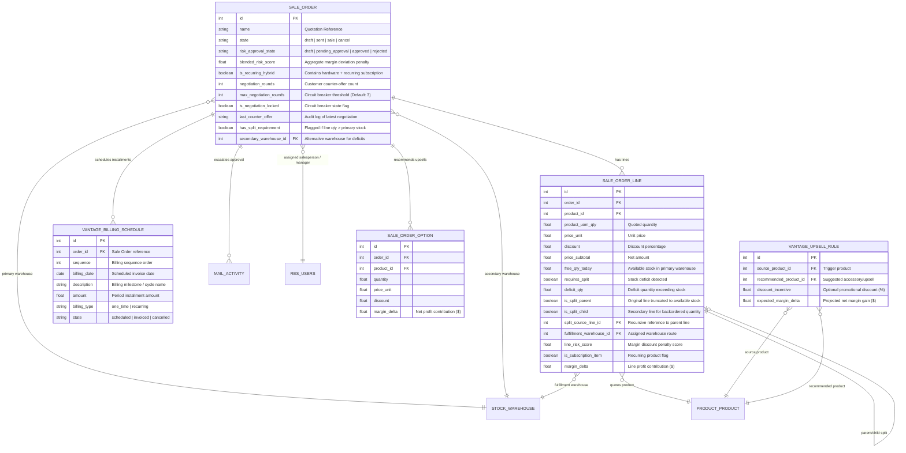

# 📊 VantageOps Data Schema & Entity Relationship Architecture

This document specifies the complete **Database Schema**, **Data Dictionary**, **Entity Relationship Model**, and **Security Access Rights** for the VantageOps application suite on Odoo.

---

## 1. Entity Relationship Model (ERD)

---

## 2. Core Data Dictionary

### Model: `sale.order` (Inherited from `sale.order`)

| Field Name | Type | Properties | Description | Module |
| :--- | :--- | :--- | :--- | :--- |
| `blended_risk_score` | `Float` | `compute='_compute_vantage_risk'`, `store=True` | Weighted risk score calculated from line discounts, margin variance, and customer tier. Deals with score > 0 require Director Approval. | `vantage_core` |
| `risk_approval_state` | `Selection` | `['draft', 'pending_approval', 'approved', 'rejected']`, `default='draft'` | State machine tracking commercial approval status. | `vantage_core` |
| `is_recurring_hybrid` | `Boolean` | `compute='_compute_is_recurring_hybrid'`, `store=True` | True if quote contains both physical hardware and recurring subscription lines. | `vantage_core` |
| `negotiation_rounds` | `Integer` | `default=0`, `readonly=True` | Number of counter-offers submitted by customer through the portal. | `vantage_governance` |
| `max_negotiation_rounds` | `Integer` | `default=3` | Configurable circuit breaker threshold preventing infinite negotiation loops. | `vantage_governance` |
| `is_negotiation_locked` | `Boolean` | `compute='_compute_is_negotiation_locked'`, `store=True` | Automatically set to True when `negotiation_rounds >= max_negotiation_rounds`. | `vantage_governance` |
| `last_counter_offer` | `Char` | `readonly=True` | Text summary of the last counter-offer discount and notes. | `vantage_governance` |
| `has_split_requirement` | `Boolean` | `compute='_compute_split_requirement'`, `store=True` | True if any order line has an inventory deficit against primary warehouse stock. | `vantage_fulfillment` |
| `secondary_warehouse_id` | `Many2one` | `comodel_name='stock.warehouse'` | Alternative warehouse targeted for backorder fulfillment splits. | `vantage_fulfillment` |
| `billing_schedule_ids` | `One2many` | `comodel_name='vantage.billing.schedule'`, `inverse_name='order_id'` | Milestone and recurring SaaS invoice schedules linked to this deal. | `vantage_fulfillment` |
| `billing_schedule_count`| `Integer` | `compute='_compute_billing_schedule_count'` | Display counter badge on the quotation form. | `vantage_fulfillment` |

---

### Model: `sale.order.line` (Inherited from `sale.order.line`)

| Field Name | Type | Properties | Description | Module |
| :--- | :--- | :--- | :--- | :--- |
| `line_risk_score` | `Float` | `compute='_compute_line_risk_score'`, `store=True` | Individual line penalty based on discount vs product category target margin. | `vantage_core` |
| `is_subscription_item` | `Boolean` | `compute='_compute_is_subscription_item'`, `store=True` | Flags whether product is categorized as a recurring subscription service. | `vantage_core` |
| `free_qty_today` | `Float` | `compute='_compute_free_qty_today'` | Live real-time unreserved quantity in order's primary warehouse. | `vantage_fulfillment` |
| `requires_split` | `Boolean` | `compute='_compute_requires_split'`, `store=True` | Flagged True when `product_uom_qty > free_qty_today`. | `vantage_fulfillment` |
| `deficit_qty` | `Float` | `compute='_compute_deficit_qty'`, `store=True` | The stock shortfall amount (`product_uom_qty - free_qty_today`). | `vantage_fulfillment` |
| `is_split_parent` | `Boolean` | `default=False` | True if this line was truncated to available stock during auto-split. | `vantage_fulfillment` |
| `is_split_child` | `Boolean` | `default=False` | True if this line was created to route the backordered deficit to secondary warehouse. | `vantage_fulfillment` |
| `split_source_line_id` | `Many2one` | `comodel_name='sale.order.line'` | Foreign key referencing the parent split line. | `vantage_fulfillment` |
| `fulfillment_warehouse_id`| `Many2one`| `comodel_name='stock.warehouse'` | Dedicated regional warehouse routing for this line. | `vantage_fulfillment` |
| `margin_delta` | `Float` | `compute='_compute_margin_delta'`, `store=True` | Real-time dollar gross margin contribution: `price_subtotal - (cost * qty)`. | `vantage_fulfillment` |

---

### Model: `vantage.billing.schedule` (New Model: `_name = 'vantage.billing.schedule'`)

| Field Name | Type | Properties | Description | Module |
| :--- | :--- | :--- | :--- | :--- |
| `order_id` | `Many2one` | `comodel_name='sale.order'`, `required=True`, `ondelete='cascade'` | Master quotation reference. | `vantage_fulfillment` |
| `sequence` | `Integer` | `default=10` | Ordering index for installment milestones. | `vantage_fulfillment` |
| `billing_date` | `Date` | `required=True`, `default=context_today` | Scheduled invoicing trigger date. | `vantage_fulfillment` |
| `description` | `Char` | `required=True` | Installment narrative (e.g., "Initial Hardware Setup", "Cycle 3 of 12"). | `vantage_fulfillment` |
| `amount` | `Monetary` | `required=True`, `currency_field='currency_id'` | Financial installment charge. | `vantage_fulfillment` |
| `billing_type` | `Selection` | `['one_time', 'recurring']`, `required=True` | Differentiates hardware delivery billing vs SaaS subscription period. | `vantage_fulfillment` |
| `state` | `Selection` | `['scheduled', 'invoiced', 'cancelled']`, `default='scheduled'` | Status workflow of the billing milestone. | `vantage_fulfillment` |

---

### Model: `sale.order.option` (Inherited from `sale.order.option`)

| Field Name | Type | Properties | Description | Module |
| :--- | :--- | :--- | :--- | :--- |
| `margin_delta` | `Float` | `compute='_compute_margin_delta'`, `store=True` | Live gross profit impact ($) added directly to native Optional Products table. | `vantage_fulfillment` |

---

## 3. Security Access Control Matrix (`ir.model.access.csv`)

| Model Technical ID | Model Description | Group Technical ID | Read | Write | Create | Unlink |
| :--- | :--- | :--- | :---: | :---: | :---: | :---: |
| `model_sale_order` | Sales Order | `base.group_user` (Internal Users) | 1 | 1 | 1 | 1 |
| `model_sale_order` | Sales Order | `base.group_portal` (Portal Users) | 1 | 0 | 0 | 0 |
| `model_sale_order_line` | Sales Order Line | `base.group_user` (Internal Users) | 1 | 1 | 1 | 1 |
| `model_vantage_billing_schedule` | Hybrid Billing Schedule | `base.group_user` (Internal Users) | 1 | 1 | 1 | 1 |
| `model_vantage_upsell_rule` | Smart Upsell Rule | `base.group_user` (Internal Users) | 1 | 1 | 1 | 1 |
